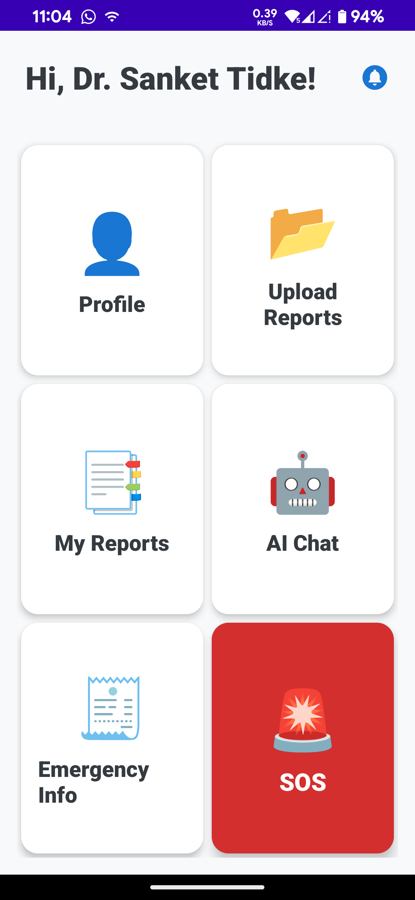
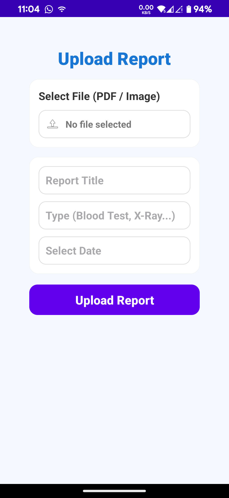
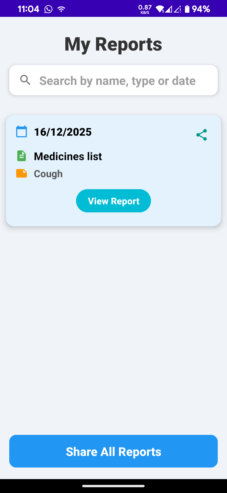
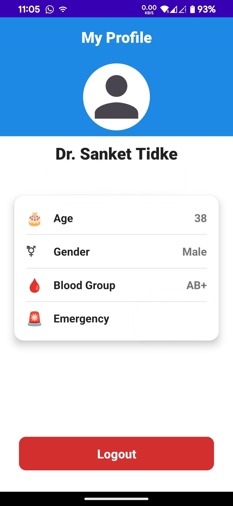
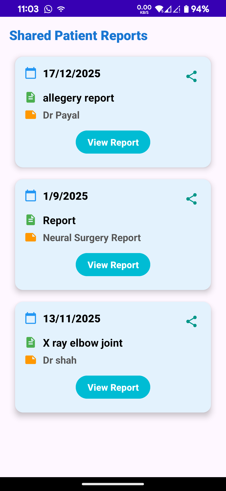
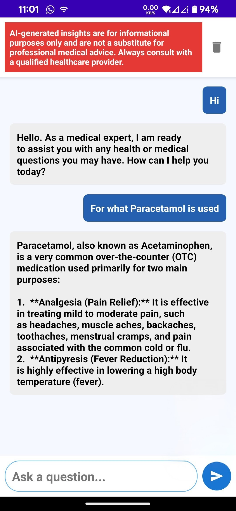

# MediVault

[](https://github.com/Omkesh-Bash/MediVault-Release-ByteMe)
[](https://console.firebase.google.com/)
[](https://drive.google.com/file/d/1uzwQ8NVO9Bo7nZRBp9qIe14Slwv4POVf/view?usp=sharing)
[](https://github.com/Omkesh-Bash/MediVault-Release-ByteMe/tree/main/app/build/outputs/apk/debug)

A secure Android app to store, manage and share personal medical reports. MediVault lets users upload and view medical reports, interact with doctors, and access emergency features — built with Java and Firebase.

---

## Quick links
- Download (recommended): Google Drive — https://drive.google.com/file/d/1uzwQ8NVO9Bo7nZRBp9qIe14Slwv4POVf/view?usp=sharing  
- Raw APK (repo branch `files`): https://github.com/Omkesh-Bash/MediVault-Release-ByteMe/tree/main/app/build/outputs/apk/debug  
- Project: https://github.com/Omkesh-Bash/MediVault-Release-ByteMe

---

## Table of contents
- [About](#about)
- [Key features](#key-features)
- [Screenshots](#screenshots)
- [Download & install](#download--install)
- [Tech stack](#tech-stack)
- [Prerequisites](#prerequisites)
- [Getting started](#getting-started)
- [Firebase setup](#firebase-setup)
- [Build & run (CLI)](#build--run-cli)
- [Project structure](#project-structure)
- [Security & notes](#security--notes)
- [Contributing](#contributing)
- [License & contact](#contact)

---

## About
MediVault is an Android application (Java) that acts as a personal vault for medical documents and reports. It provides user authentication, report upload/view/list functionality, doctor-side review/verification, an in-app chat/AI assistant, and emergency for rapid access.

---

## Key features
- ✅ User authentication (signup / login)  
- ✅ Upload, view and list medical reports (with adapters & utilities)  
- ✅ Doctor workflows: verification, inbox and report review  
- ✅ In-app chat / AI assistant screen  
- ✅ Emergency mode 
- ✅ Firebase integration (Auth, Storage, Database, Messaging)

---

## Screenshots

| Home — Reports list | Upload report | Saved reports |
|:---:|:---:|:---:|
|  |  |  |

| Profile | Shared notification | AI Chat |
|:---:|:---:|:---:|
|  |  |  |

---

## Download & install

Important:
- APKs installed from outside the Play Store require the user to enable "Install unknown apps" for the installing app (browser or file manager).  
- Make sure you trust the source before installing. Review the code or build yourself if you need maximum assurance.

Download options (choose one):
- **Google Drive** (recommended for easy public sharing)  
  [Download Final MediVault.apk — Google Drive](https://drive.google.com/file/d/1uzwQ8NVO9Bo7nZRBp9qIe14Slwv4POVf/view?usp=sharing)

- **Raw file from this repository** (branch `files`)  
  [Download Final MediVault.apk — Raw GitHub](https://github.com/Omkesh-Bash/MediVault-Release-ByteMe/tree/main/app/build/outputs/apk/debug)

How to install:
1. Download the APK.
2. On your Android device, enable installation from unknown sources for the app you use to open the APK (Settings → Apps → Browser/File Manager → Install unknown apps).
3. Open the APK file and follow the installer prompts.

Optional verification:
- We recommend verifying the APK checksum after download. Example (on Linux/macOS):
  ```bash
  shasum -a 256 Final\ MediVault.apk


## Tech stack

* Android (Java)
* Gradle (build system)
* Firebase (Auth, Storage, DB, Cloud Messaging)
* XML layouts for UI

---

## Prerequisites

* JDK 11+ (or the JDK required by your Android Gradle plugin)
* Android Studio (recommended) or Android SDK + Gradle CLI
* Android SDK platform(s) targeted by the project
* A Firebase project (if you want to run with backend services)

---

## Getting started

1. Clone:
```bash
git clone [https://github.com/Omkesh-Bash/MediVault-Release-ByteMe.git](https://github.com/Omkesh-Bash/MediVault-Release-ByteMe.git)
cd MediVault-Release-ByteMe

```


2. Open in Android Studio and let Gradle sync.
3. Configure Firebase (see below) or replace `app/google-services.json` with your file.
4. Run on emulator or device.

---

## Firebase setup

1. Create a Firebase project: https://console.firebase.google.com/
2. Add an Android app with the package name found in `AndroidManifest.xml`.
3. Download `google-services.json` and place it at:
```
app/google-services.json

```


4. Enable the services the app uses:
* Authentication (Email/Password)
* Cloud Storage (for report files)
* Firestore / Realtime Database (app data)
* Cloud Messaging (optional)


Security: Do not commit production credentials or private keys.

---

## Build & run (CLI)

* Build debug APK:
```bash
./gradlew :app:assembleDebug

```


* Install on a connected device:
```bash
./gradlew :app:installDebug

```


* Clean:
```bash
./gradlew clean

```


---

## Project structure
(high level)

* **app/**
* **src/main/java/com/example/medivault/** — main Java sources
* Activities: Splash, Login, Signup, Home, Profile
* Reports: UploadReportActivity, ViewReportActivity, MyReportsActivity
* Doctor: DoctorHomeActivity, DoctorInboxActivity, DoctorVerificationActivity
* Chat: AiChatActivity, ChatAdapter, ChatMessage
* Models / Utils: Report, ReportUtils, DoctorUtils, etc.


* **src/main/res/** — layouts, drawables, strings
* **AndroidManifest.xml** — app manifest & permissions
* **google-services.json** — Firebase config (replace with your project file)


---

## Security & notes

* Do not publish APKs containing secret API keys or production credentials.
* For production, configure Firebase security rules to restrict access to authenticated users and to validate uploads.
* Prefer distributing signed release builds via Play Store or official channels for production usage.

---

## Contributing

Thanks for your interest! Suggested workflow:

1. Fork → create branch:
```bash
git checkout -b feat/your-feature

```


2. Make changes and open a pull request with a clear description.

---

## Contact
  
| Contributors |
  |------------|
| [Prafulla0001](https://github.com/Prafulla0001/) |
| [wahedpathan2020-bit](https://github.com/wahedpathan2020-bit) |
| [shravani12vc-star](https://github.com/shravani12vc-star) |
| [Omkesh-Bash](https://github.com/Omkesh-Bash) |
